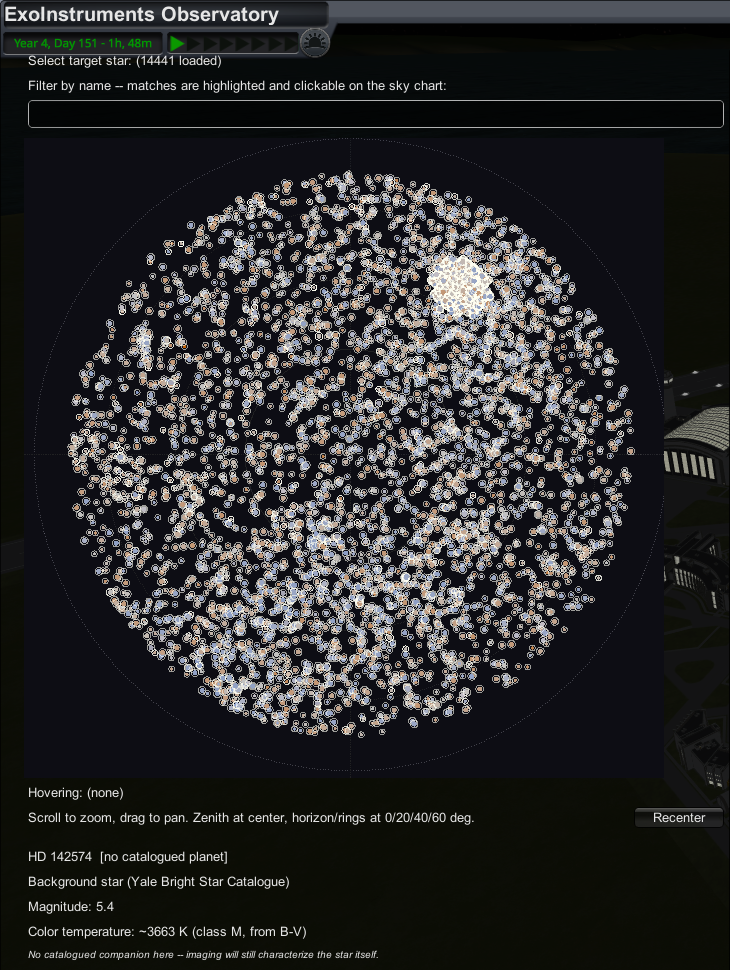

# ExoInstruments: Exoplanet Astrophysics in Kerbal Space Program

*Extending the observational frontier of Kerbal astronomy beyond the Kerbol system, one photon-noise-limited light curve at a time.*

---

## License Summary

This project uses a proprietary license. It is not a Creative Commons license: redistribution of copies (even unmodified ones) is not permitted here, only personal use of the original. Full legal terms are in [LICENSE](./LICENSE).

## Overview

**ExoInstruments** is an independent mod for *Kerbal Space Program 1* that replaces the game's fictional science-experiment loop with a ground-based exoplanet survey built on real observational astrophysics. Rather than abstracting "science points" from generic biome scans, the mod asks the player to run an actual survey program: select a star from a real catalog, choose an instrument appropriate to its brightness and the physics of the detection method, and extract a signal from simulated, noise-limited data exactly the way an observational astronomer would.

## Key Features

- **Physically grounded stellar catalog.** Target stars are drawn from real astronomical data (including cross-matched entries from trustworthy exoplanet databases), each carrying its own apparent magnitude, spectral properties, and, where a companion is known, real orbital parameters. A star's baseline observability is governed by its magnitude, not an arbitrary game-balance number.

- **Photon-noise-limited instrumental precision.** Every instrument's achievable measurement precision is modeled as a function of target magnitude via the same photon-noise scaling relation used in the observational literature. Fainter stars are always harder to characterize; no instrument cheats this trade-off.

- **Three independent detection pipelines.**
  - **Transit photometry**: searching a simulated light curve for the periodic, shallow flux decrement of a planet crossing its host star's disk, recovered via phase-folding and box-least-squares-style period search -- with moving-median detrending and a physical duty-cycle envelope, the same vetting real BLS pipelines use against starspot false positives.
  - **Radial velocity**: recovering the host star's reflex Doppler wobble induced by an orbiting companion, including multi-planet systems resolved through iterative signal prewhitening.
  - **Direct imaging**: resolving a companion at its real angular separation and thermal contrast against the diffraction limit and a decaying speckle floor, independent of transit or RV geometry.

- **Simultaneous multi-planet transit modeling.** Compact systems superpose every transiting member on one light curve (TRAPPIST-1 style); the detector separates them by iterative in-transit masking -- the photometric analogue of the RV path's prewhitening -- and a multi-planet campaign pays the same jackpot bonus the RV path does.

- **Transit Timing Variations (TTV).** In multi-planet systems, mutual gravitational perturbation shifts each transit early or late against a linear ephemeris: a sinusoidal signal at the pair's resonant super-period (Lithwick, Xie & Wu 2012; Agol et al. 2005). The timing analysis measures individual mid-transit times by template fitting, re-fits the linear ephemeris from the times themselves (refining the period far beyond the BLS grid), and searches the O-C series for the sinusoid -- pure-gravity evidence of a companion, whether or not the perturber ever transits.

- **The Rossiter-McLaughlin effect.** When a transiting planet crosses its rotating star during an RV campaign, it blocks a moving sliver of blueshifted or redshifted starlight and imprints a characteristic in-transit anomaly (Ohta, Taruya & Suto 2005) -- the real-world measurement of spin-orbit alignment. The first mechanic where both pipelines observe the same event: with a known photometric ephemeris, the spectrograph automatically samples transit windows at high cadence, and the analysis fits the anomaly for the projected obliquity lambda and v sin(i). Each star's rotation ties consistently into the same StellarActivity model that drives its jitter and spots; obliquities follow the observed aligned-plus-misaligned-tail distribution (Albrecht et al. 2012).

- **The Mün and Minmus as observing constraints.** Both moons ride the simulated sky with real phases from solar elongation. A moon crossing the line of sight occults the target outright -- the Mün subtends about a degree of Kerbin's sky, ~15x the solid angle of Earth's Moon -- and scattered moonlight raises the sky background for photometry with the Krisciunas & Schaefer (1991) separation dependence: sky noise scales as 10^(0.4 dm) against a target's magnitude, so full-Mün nights push faint targets off the schedule exactly as they do at real observatories. Physically scoped: spectrographs measure line positions and the ELT images in H band, so only transit photometry pays the moonlight tax (occultation stops everyone).

- **Observing-quality forecast heatmap.** One color-coded calendar per target/instrument pairing -- rows are the nights ahead, columns the time of night -- folding together everything the session models actually charge for: twilight, target altitude, airmass scintillation, lunar occultation and moonlit-sky pollution. A continuous porkchop-plot-style gradient (red = closed/poor through deep blue = prime); click any cell (or the "best window" button) to warp straight there. Honest per method: the RV map is deliberately binary, because simulated spectrograph precision genuinely doesn't vary with airmass.

- **BetterTimeWarp integration (soft dependency).** Stock KSP's `WarpTo` quietly caps scheduled warps at 100,000x no matter what warp mod is installed. When [BetterTimeWarpContinued](https://github.com/linuxgurugamer/BetterTimeWarpContinued) is present, every "Warp to ..." button in the mod (suggested RV baseline, next transit window, 5-sigma exposure, forecast cells) installs the fastest warp-rate set the player has configured and lifts the cap to match -- long campaigns cross weeks of nights in seconds. Resolved by reflection: without the mod, everything falls back to stock behavior untouched.

- **Ground-based observing windows.** Every ground-based instrument -- not just the imaging flagship -- only collects data when its site can actually see the target: Sun below twilight, target above the telescope's altitude limit. The resulting diurnal gaps give ground-based light curves an honest window function, aliases and all, exactly the artifact real box-least-squares searches fight; TESS's continuous space-based coverage becomes a genuine, purchasable advantage rather than a flavor line.

- **Stellar activity as the true noise floor.** Every star carries a persistent, deterministic activity level: radial-velocity jitter (Wright 2005) added in quadrature beneath every spectrograph's instrumental precision -- the real reason ESPRESSO's 10 cm/s does not trivially yield Earth-mass detections -- and quasi-periodic starspot modulation at the stellar rotation period (rotation bands per McQuillan et al. 2014, amplitudes per Basri et al. 2013) that the transit search has to dig through.

- **Limb-darkened transit shapes.** Transits are no longer box-shaped: the light curve follows the small-planet approximation of Mandel & Agol (2002) with quadratic limb darkening interpolated against stellar effective temperature (Claret & Bloemen 2011) -- round-bottomed central transits, shallow smooth ingress/egress, and V-shaped grazing events, the same morphological diagnostics real vetting pipelines rely on.

- **Atmospheric scintillation.** Ground-based photometry pays the airmass tax: per-exposure noise carries the Young (1967) scintillation excess above zenith, scaled by each instrument's real aperture and site altitude -- chasing a target down toward the horizon costs real precision, and small-aperture survey cameras (WASP's regime) feel it most.

- **Realistic stellar color, on the sky chart and at the eyepiece.** Every star's display tint comes from its own effective temperature (catalog spectroscopy, or a B-V-derived estimate for background stars) through a real blackbody-to-sRGB mapping -- the sky reads as visibly varied (blue-white giants, orange-red dwarfs) instead of a flat single hue.

- **Eyepiece mode.** A pure-vibes view of the sky field around any selected target: real magnitudes, real colors, real relative positions rendered through a proper gnomonic projection and a Gaussian point-spread function (bright stars bloom to a white core, faint ones stay tight points) -- no names, no numbers, no science overlay. Fully fog-of-war-safe: everything shown is directly observable data.

- **A meaningful instrument-acquisition economy.** Career-mode progression is not a flat tech tree: each observatory carries its own acquisition cost and per-observation operating cost in Funds, gated behind a cumulative Science-earned threshold representing the survey track record required to justify a larger investment. Higher-precision, higher-cost instruments unlock proportionally larger scientific rewards upon a confirmed detection, incentivizing genuine capital investment in observational capability, not grinding.

- **Career-mode discovery loop ("fog of war").** In career games, a star's identity and catalog status are withheld until it has actually been observed, mirroring the epistemic position of a real survey, where a target is just a point of light and a magnitude until data says otherwise. A much larger real background-star catalog is blended in as camouflage -- decoys are never given a procedurally-injected planet, so anything a player discovers is a genuinely real system.

- **Decluttered sky chart.** Real exoplanet surveys are extremely non-uniform on the sky (Kepler's single field alone contributed thousands of hosts) -- a density-aware thinning pass caps how many real hosts survive in any one coarse sky cell so no single dense survey field gives away "something's here" to a career-mode player before they've ever scanned it.

## The Telescope Fleet

Each instrument's reference precision and operating cadence are drawn directly from its own instrument paper (see in-code citations). Progression is structured so that a larger capital investment purchases a genuine, physically justified improvement in noise floor, not merely a re-skinned number.

| Instrument | Type | Detection Method | Relative Noise Level | Academic Role |
|---|---|---|---|---|
| **WASP** | Wide-field, small-aperture (200 mm lens) survey camera | Transit Photometry | High (~1000 ppm) | Entry-level, low-cost fog clearing on bright, easy targets; the real SuperWASP's niche of hot-Jupiter discovery around bright stars |
| **SPECULOOS** | Four 1 m robotic telescopes (Paranal) | Transit Photometry | Low (~150 ppm) | The survey's photometric workhorse; precision tuned for detecting small, temperate planets around ultra-cool dwarfs |
| **TESS** | Space-based, 10.5 cm aperture, all-sky survey | Transit Photometry | High (~1095 ppm) | NASA Explorer-class flagship transit survey; wide-field, space-based photometry immune to atmospheric noise, gated behind a significant capital and track-record threshold |
| **SOPHIE** | 1.93 m spectrograph (Observatoire de Haute-Provence) | Radial Velocity | Moderate (~2.0 m/s) | Entry point into spectroscopic RV detection; smaller aperture, requires brighter targets for comparable signal-to-noise |
| **HARPS** | 3.6 m ESO telescope (La Silla) | Radial Velocity | Low (~1.0 m/s) | Long-baseline RV workhorse; the historical benchmark instrument of the field |
| **ESPRESSO** | VLT-fed ultra-stable spectrograph | Radial Velocity | Ultra-Low (~0.15 m/s) | The RV path's capstone instrument; sub-10 cm/s precision under ideal conditions, capable of resolving Earth-mass reflex signals |
| **ELT** | 39.3 m Extremely Large Telescope (Cerro Armazones) | Direct Imaging | Contrast-limited (~10⁻⁴ at 1 λ/D) | Flagship direct-imaging capability; resolves and characterizes companions at real angular separations and thermal contrasts, independent of transit or RV geometry |

## Future Roadmap

The following mechanics are planned extensions, not yet implemented in the current build:

- **Naming rights & a discovery archive.** Let the player name a planet on confirmation (mirroring real IAU public-naming contests), and auto-generate a logbook entry per detection -- light curve, date, instrument -- as an in-game "publication" wall. Possibly tied to a future community/multiplayer layer (other players' discoveries in the same archive, a shared naming pool); feasibility of that link needs real thought before committing to it, this stays a maybe.
- **Weather in the observing forecast.** Stock KSP has no weather system to read, so the forecast heatmap deliberately carries no weather term. The natural extension is a hook into a weather mod (e.g. Kerbal Weather Project) so real cloud cover and seeing -- not just airmass and twilight -- degrade the forecast and close the dome.
- **A proper in-world observatory building.** Replacing the current placeholder entry point with a dedicated Kerbal Konstructs structure at the KSC, including a visible open/closed state texture, so the observatory reads as a real facility rather than a debug stand-in. In the meantime, a white square is placed in the KSC toolbar. Attempted once already and shelved -- KerbalKonstructs' structure/texture pipeline turned out to be more finicky than expected, so this is lower priority until there's a clearer plan for it.
- **Space-based telescope facilities and atmospheric classification.** Extending the instrument roster beyond ground-based facilities to satellite observatories, modeled after concept missions such as ESA's LIFE (Large Interferometer For Exoplanets), with chemical and biosignature classification of a detected planet's atmosphere as a further scientific payoff.
- **Extended instrument catalog.** Additional real-world facilities (e.g. next-generation ground-based spectrographs) as further rungs in the progression ladder.
- **Deeper catalog integration.** Continued cross-matching against professional exoplanet and stellar databases to expand the pool of scientifically authentic targets and improve the realism of stellar characterization (temperature, spectral classification) for stars without complete published data.
- **Integration of body replica database.** Using an auxiliary mod like Real Exoplanets to create physical bodies, and link it to the exoplanet detection pipeline.
- **Economy refactor.** Changing the values applied to the career-mode use of this mod. Still need to test and balance it. The goal is to guide the player to discover exoplanets alongside their KSP journey.

## Acknowledgments & Scientific Inspiration

This project's detection pipelines and instrumental modeling are directly inspired by the historic 1995 discovery of 51 Pegasi b by Michel Mayor and Didier Queloz ; the intellectual origin point for this entire codebase. 51 Pegasi's exact physical parameters are integrated directly into the mod's stellar catalog.

Special thanks to the following institutions at ETH Zürich whose research and vision fueled the logic of this mod:
*   **The Queloz Group**, For pioneering the radial velocity and transit precision standards modeled in this simulation.
*   **The Exoplanets and Habitability Group**, For their invaluable contributions to planetary detection and characterization.
*   More broadly, **The Center for Origin and Prevalence of Life (COPL)**, For inspiring the grander vision behind this project and pushing the boundaries of exoplanetary science.

This repository is offered as an independent demonstration of scientific outreach and computational modeling.

> ### A Personal Note
>
> *"This project is my tribute to the human curiosity, that refuses to let us be lonely in the dark. My only hope is that this mod can spark a passion for astronomy, and perhaps inspire others to follow the path of scientific studies."*
>
> **Baptiste Gress**
