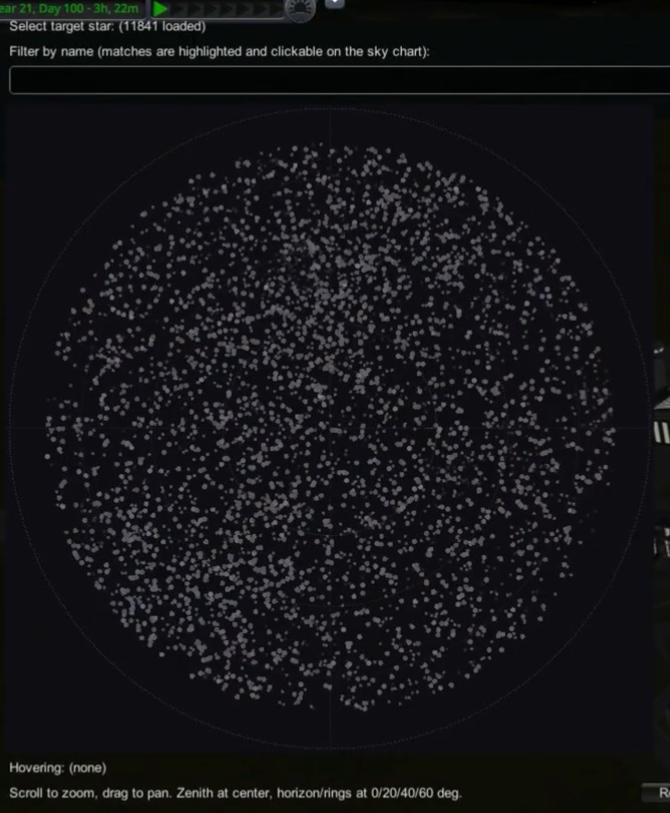
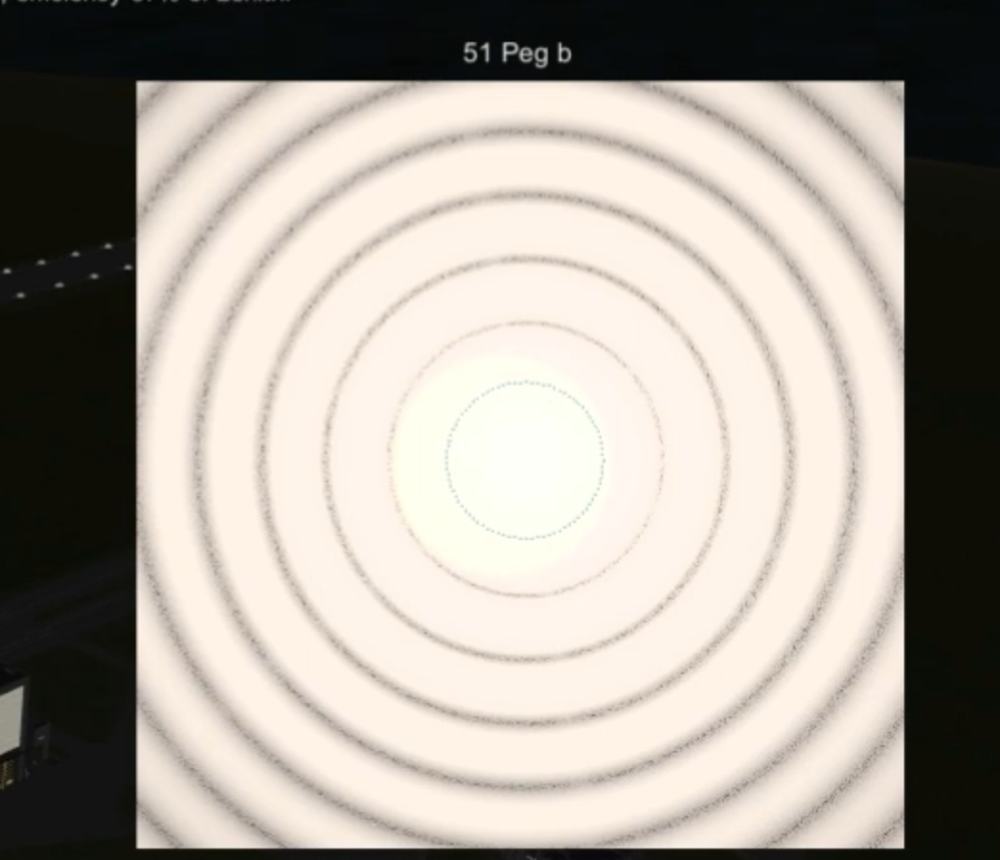
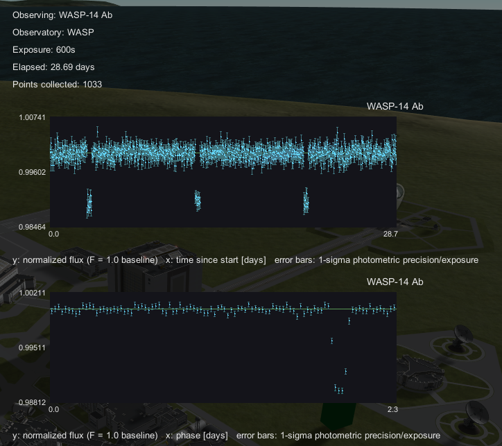
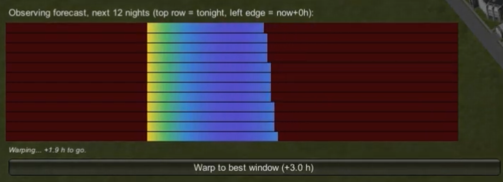
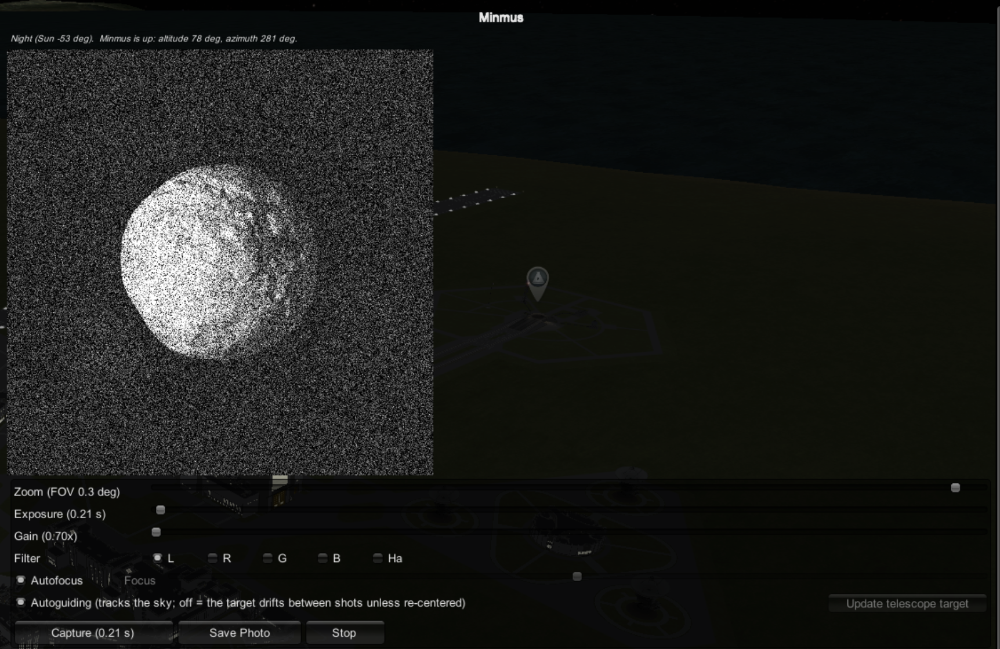
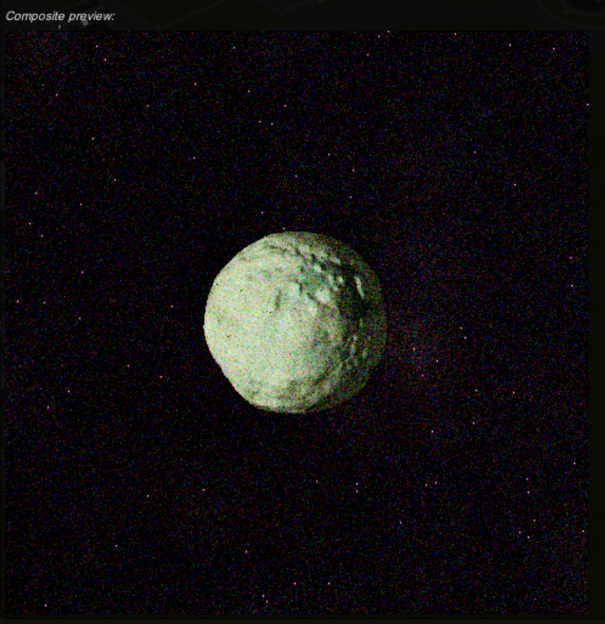
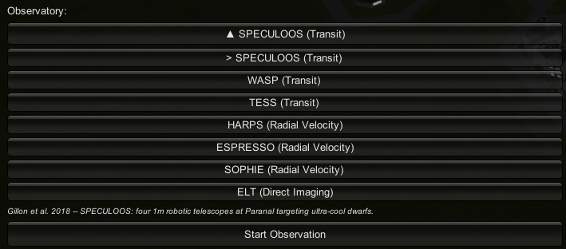

# ExoInstruments: Exoplanet Astrophysics in Kerbal Space Program

*Extending the observational frontier of Kerbal astronomy beyond the Kerbol system, one photon-noise-limited light curve at a time.*

---

## License Summary

This project uses a proprietary license. It is not a Creative Commons license: redistribution of copies (even unmodified ones) is not permitted here, only personal use of the original. Full legal terms are in [LICENSE](./LICENSE).

## Overview

**ExoInstruments** is an independent mod for *Kerbal Space Program 1* that replaces the game's fictional science-experiment loop with a ground-based exoplanet survey built on real observational astrophysics. Rather than abstracting "science points" from generic biome scans, the mod asks the player to run an actual survey program: select a star from a real catalog, choose an instrument appropriate to its brightness and the physics of the detection method, and extract a signal from simulated, noise-limited data exactly the way an observational astronomer would.


## Key Features

- **Physically grounded stellar catalog.** Target stars are drawn from real astronomical data, each carrying its own apparent magnitude, spectral properties, and, where a companion is known, real orbital parameters.

<p align="center"></p>

- **Photon-noise-limited instrumental precision.** Every instrument's achievable precision scales with target magnitude via the same photon-noise relation used in the observational literature; fainter stars are always harder, no instrument cheats the trade-off.

- **Three independent detection pipelines.**
  - **Transit photometry**: box-least-squares-style period search over a simulated light curve, with moving-median detrending and a physical duty-cycle envelope against starspot false positives.
  - **Radial velocity**: recovering the host star's reflex Doppler wobble, including multi-planet systems resolved through iterative signal prewhitening.
  - **Direct imaging**: resolving a companion at its real angular separation and thermal contrast against the diffraction limit and a decaying speckle floor.

<p align="center"></p>

- **Simultaneous multi-planet transit modeling.** Compact systems (TRAPPIST-1 style) superpose every transiting member on one light curve; the detector separates them by iterative in-transit masking, and a multi-planet campaign pays a jackpot bonus.

- **Transit Timing Variations (TTV).** Mutual gravitational perturbation shifts each transit early or late against a linear ephemeris (Lithwick, Xie & Wu 2012); the analysis re-fits the ephemeris from measured mid-transit times and searches the residuals for the perturber's signature; pure-gravity evidence of a companion even if it never transits.

- **The Rossiter-McLaughlin effect.** A transiting planet crossing its rotating star imprints a characteristic in-transit RV anomaly (Ohta, Taruya & Suto 2005), the real measurement of spin-orbit alignment; the one mechanic where the photometric ephemeris automatically schedules the spectroscopic campaign.

- **The Mün and Minmus as observing constraints.** Both moons occult targets outright and raise the sky background with a real separation-dependent brightness law (Krisciunas & Schaefer 1991); full-Mün nights push faint targets off the schedule the way they do at real observatories.

- **Observing-quality forecast heatmap.** A porkchop-style color calendar per target/instrument (rows = nights ahead, columns = time of night) folding in twilight, altitude, airmass scintillation, and lunar occultation/moonlight. The RC20's solar-system forecast additionally factors in real EVE cloud cover over KSC. Click any cell, or the "best window" button, to warp straight there.

- **BetterTimeWarp integration (soft dependency).** When [BetterTimeWarpContinued](https://github.com/linuxgurugamer/BetterTimeWarpContinued) is installed, every "Warp to..." button in the mod uses it to lift stock KSP's silent 100,000x warp cap; without it, everything falls back to stock behavior untouched.

<p align="center"></p>

- **Ground-based observing windows.** Every ground-based instrument only collects data when the Sun is below twilight and the target is above the telescope's altitude limit; real diurnal gaps and window-function aliases, the same artifact real BLS searches fight.

<p align="center"></p>

- **Stellar activity as the true noise floor.** Every star carries persistent RV jitter (Wright 2005) and quasi-periodic starspot modulation (McQuillan et al. 2014; Basri et al. 2013) that the instruments have to see past.

- **Limb-darkened transit shapes.** Transits follow the small-planet approximation of Mandel & Agol (2002) with quadratic limb darkening interpolated against stellar temperature (Claret & Bloemen 2011); round-bottomed central transits, V-shaped grazing ones.

- **Atmospheric scintillation.** Ground-based photometry pays the Young (1967) airmass tax, scaled by each instrument's real aperture and site altitude.

- **Realistic stellar color.** Every star's tint comes from its own effective temperature through a real blackbody-to-sRGB mapping.

- **Solar-system astrograph, four real instruments.** A separate, non-exoplanet instrument mode: a real live-rendered photo of any Kerbol-system body, clicked directly on the sky chart (planets and moons plot there at their real size/color, right alongside the stars). Every optics/sensor constant driving the physics (aperture, focal length, native resolution, pixel pitch, quantum efficiency, full well, read/dark noise, exposure and gain range, per-filter bandwidth, off-axis astigmatism, adaptive-optics correction) is drawn from a per-instrument spec rather than hardcoded, so switching telescopes from the Observatory menu changes the actual physics, not just a label. The imaged body's real apparent magnitude (real albedo, radius, Sun distance, phase angle, Lambertian phase law) is converted through a real photon-flux/aperture/QE/filter-bandwidth chain into real electrons, so noise, saturation, and signal-to-noise all follow real photon statistics rather than an invented brightness scale. A genuine timed exposure (nothing renders until the shutter time you set has actually elapsed), with exposure, gain, a filter wheel matching whichever real filters that telescope actually has, manual focus, and autoguiding. Every frame runs through a full sensor noise chain modeled on real detector-simulation and CCD physics literature: shot noise, dark current, read noise (correctly rescaled for the current pixel-binning factor), a fixed hot/dead pixel map, atmospheric extinction and scintillation, seeing-driven blur (or, for an adaptive-optics instrument, its own real corrected resolution instead), full-well blooming (Janesick 2001), charge-transfer smear (Short et al. 2010's CDM model), a real sea-level cosmic-ray flux (Particle Data Group), and a sky background built from real published surface brightnesses in V magnitudes per square arcsecond (airglow at Paranal's measured 21.7 mag/arcsec² with the van Rhijn 1921 zenith-angle law, zodiacal light per Leinert et al. 1998, lunar scattering per Krisciunas & Schaefer 1991, and twilight per Patat et al. 2006), with wavelength-dependent extinction so a blue filter really does lose more light than a red one; plus real cloud cover and haze read live from EVE (Environmental Visual Enhancements) when it's installed. A selectable neutral-density filter (real photographic ND stops through a real ND 5.0 solar-filter-grade option) handles the extreme brightness of Kerbin-system moons, which sit far closer to their star than any real moon does. Monochrome and grainy on purpose: a single unprocessed sensor frame, not a stretched, denoised final image; saved as both PNG and a real 16-bit FITS file with standard acquisition-software header keywords, the same format a real telescope and camera setup would actually write.

- **The instrument roster.** Each one modeled end to end on a real, specific, named telescope and detector, not an invented gameplay scale:
  - **RC20**: a PlaneWave RC20 (f/6.8, 0.51m aperture, real secondary obstruction) with a ZWO ASI294MM Pro camera (native 4144x2822 resolution, real full well, read noise, dark current, quantum efficiency); no autoguider by default.
  - **CDK1000**: a PlaneWave CDK1000 (1.0m aperture, f/6, real 47% central obstruction), the same optical tube PlaneWave actually installed at Palomar Observatory in 2024 for MIT's WINTER project, on the same ZWO camera as the RC20.
  - **VLT FORS2**: the real Very Large Telescope, Unit Telescope 1 "Antu", 8.2m, carrying FORS2's real imager: a mosaic of two MIT/Lincoln-Lab CCID20 CCDs at their own real published plate scale, full well, gain, and read noise; always autoguided, since a real 8.2m research telescope has no unguided operating mode.
  - **VLT SPHERE**: the same VLT, Unit Telescope 3 "Melipal", carrying the real SPHERE/ZIMPOL extreme-adaptive-optics imaging polarimeter. Where FORS2 is limited by ordinary atmospheric seeing no matter the mirror size, SPHERE's SAXO adaptive-optics system corrects that turbulence in real time, reaching a real, published resolution around 25 milliarcseconds, tens of times finer. The tradeoff is real too: ZIMPOL's actual field of view is barely 3.6 arcseconds wide, and it has no blue filter at all.

- **A real star field behind every photograph.** A photograph's sky is no longer empty. The frame is built the way professional image simulators build one (GalSim, SkyMaker, ESA's Pyxel): as a sum of sources, each carrying its own independently computed flux, summed on one plane before the telescope's optics and the sensor's noise are applied — instead of one rendered image scaled to the target's brightness, under which nothing but the target could ever have had a correct brightness. Stars come from a **Gaia DR3** catalogue you build yourself (see below; nothing ships, and without one the sky is simply empty), placed by a real gnomonic tangent-plane projection (the TAN projection of the FITS standard) built from the telescope's own pointing, so they land where they actually are relative to the planet you are photographing. Each one's colour is real: its catalogue B-V gives its temperature, and its brightness is carried into whichever filter is fitted across that temperature's own spectrum, so a hot blue star and a cool orange one photograph differently through an LRGB set. Moons and planets too small for the optics to resolve are drawn through the same path from their own real apparent magnitude, which is how a giant planet's moons appear as points of light beside it. Without an autoguider the sky rotates under the instrument during the exposure and everything trails — along the true direction for your observatory's latitude, curving, with stars near the frame edge trailing further than those at its centre, because the sky's own rotation is applied rather than the image being smeared sideways.

  *Note: the exoplanet detection pipeline is untouched. It keeps searching the small Bright Star Catalogue on purpose, so finding a transit stays a tractable hunt; the rendered star catalogue exists only to fill in what a camera sees.*

- **RC20 image stacking.** Capture a series of subs per filter and combine them into one clean LRGB composite: cosmetic (bad-pixel-map) correction before alignment (the same calibration step real pipelines like PixInsight and IRAF/ccdproc run before registration), optional centroid alignment between frames, robust sky-background subtraction, luminance-transfer color composition (R/G/B scaled by the deeper L stack, capped against noise blow-up), an optional Hα blend into the red channel, and a display-only asinh stretch to bring out faint stacked detail; the same reason real astrophotographers shoot many short exposures instead of one long one. An optional **lucky imaging** mode keeps only the sharpest subs (ranked by a real variance-of-Laplacian focus metric, Pech-Pacheco et al. 2000) before stacking, following the same selective-frame principle real lucky imaging uses to beat atmospheric seeing (Fried 1978).

<p align="center">
  
  
</p>
<p align="center"><em>Minmus: a single raw L sub (left) vs. the stacked LRGB composite (right).</em></p>

- **A meaningful instrument-acquisition economy.** Career-mode progression gates each observatory behind an acquisition cost and a cumulative Science-earned threshold, so higher-precision instruments represent a genuine capital investment, not a flat tech tree.

- **Career-mode discovery loop ("fog of war").** A star's identity and catalog status stay hidden until actually observed. A large real background-star catalog is blended in as camouflage, so anything discovered is a genuinely real system.

- **Decluttered sky chart.** A density-aware thinning pass caps how many real hosts survive per sky cell, so a single dense survey field (Kepler-style) can't give away "something's here" before it's ever been scanned. Solar-system bodies get their own decluttering too: a planet and its own moons often land on nearly the same point of sky from Kerbin, so overlapping markers are nudged apart into a small ring, just far enough that each one stays individually clickable at any zoom level.

- **A real, upgradeable KSC Observatory building.** Not a toolbar button bolted onto stock scenery, but a genuine facility built on the same stock systems the VAB or Astronaut Complex use; real hover highlighting, a real right-click facility dialog, and a real funds-gated upgrade path. Its telescope continuously points at whatever target is currently being observed, using the same real altitude/azimuth conversion the rest of the mod already relies on, so the rig's orientation reflects the target's actual position in Kerbin's sky, not a cosmetic animation.

## The Telescope Fleet

Each instrument's reference precision and cadence are drawn directly from its own instrument paper (see in-code citations).

<p align="center"></p>

| Instrument | Type | Detection Method | Relative Noise Level | Academic Role |
|---|---|---|---|---|
| **WASP** | Wide-field, small-aperture (200 mm lens) survey camera | Transit Photometry | High (~1000 ppm) | Entry-level, low-cost fog clearing on bright, easy targets |
| **SPECULOOS** | Four 1 m robotic telescopes (Paranal) | Transit Photometry | Low (~150 ppm) | The survey's photometric workhorse; tuned for small planets around ultra-cool dwarfs |
| **TESS** | Space-based, 10.5 cm aperture, all-sky survey | Transit Photometry | High (~1095 ppm) | Space-based photometry immune to atmospheric noise, gated behind a real capital threshold |
| **SOPHIE** | 1.93 m spectrograph (Observatoire de Haute-Provence) | Radial Velocity | Moderate (~2.0 m/s) | Entry point into spectroscopic RV detection |
| **HARPS** | 3.6 m ESO telescope (La Silla) | Radial Velocity | Low (~1.0 m/s) | Long-baseline RV workhorse; the field's historical benchmark |
| **ESPRESSO** | VLT-fed ultra-stable spectrograph | Radial Velocity | Ultra-Low (~0.15 m/s) | The RV path's capstone; sub-10 cm/s, resolving Earth-mass reflex signals |
| **ELT** | 39.3 m Extremely Large Telescope (Cerro Armazones) | Direct Imaging | Contrast-limited (~10⁻⁴ at 1 λ/D) | Flagship direct-imaging capability, independent of transit or RV geometry |
| **RC20** | PlaneWave 20" astrograph | Solar-System Photography | N/A; not an exoplanet detector | A real backyard-class scope: point-and-shoot photos of planets and moons in the Kerbol system |
| **CDK1000** | PlaneWave CDK1000, 1.0 m Corrected Dall-Kirkham (Palomar-class) | Solar-System Photography | N/A; not an exoplanet detector | Research-grade step up from the RC20: nearly four times the light-collecting area |
| **VLT FORS2** | Real VLT Unit Telescope 1, 8.2 m, real FORS2 imager | Solar-System Photography | N/A; not an exoplanet detector | The actual Very Large Telescope, pointed at the neighborhood instead of a distant galaxy |
| **VLT SPHERE** | Real VLT Unit Telescope 3, 8.2 m, real SPHERE/ZIMPOL adaptive optics | Solar-System Photography | N/A; not an exoplanet detector | Same VLT, extreme adaptive optics: real ~25 mas resolution instead of ordinary seeing |

## Solar-System Observing Guide

The right instrument for a target isn't the biggest one — it's whichever one actually *frames* the body without either overflowing the field (empty magnification) or shrinking it to a handful of pixels. The tables below are computed straight from each instrument's real aperture, focal length, and sensor (§7.00/§7.11 of the [technical reference](./TECHNICAL_REFERENCE.md)), not eyeballed.

**Reading the tables:** "px @ tight zoom" is the target's diameter in pixels once fully zoomed in (real Barlow/HR-collimator factor where the instrument has one); "% of frame" is that diameter against the sensor's own long axis at that zoom. A target well over 100% has genuinely overflowed the field — you're looking at a crop, not the whole disk.

### Stock Kerbol system (from Kerbin)

| Target | Apparent size | Best instrument | Zoom | Notes |
|---|---|---|---|---|
| **Mün** | ~6875″ (1.9°) | *(none)* | — | Too close for any instrument here — it overflows every field by 20×+. This is a naked-eye/map-view target, not a telescope one. |
| **Minmus** | ~527″ (8.8′) | RC20 / CDK1000 | **Wide** (no Barlow) | Also overflows at tight zoom; frames nicely (~46% of the wide field) with the Barlow backed out. |
| Eve | 76.7″ | CDK1000 | Tight | 46% of frame, 1926 px across. Genuinely bright (thick, reflective cloud deck) — watch the live saturation readout and dial in an ND filter if it clips. |
| Jool | 44.9″ | CDK1000 | Tight | 27% of frame, 1127 px — best balance of framing and light. FORS2 gives more light-collecting area but a wider tight-zoom field, so it frames Jool smaller (17%). |
| Duna | 18.5″ | CDK1000 | Tight | 11% of frame, 466 px — enough to show real surface contrast. |
| Moho | 12.4″ | CDK1000 | Tight | 8% of frame, 311 px — small and dim; needs a real exposure, not a snapshot. |
| Ike | 7.5″ | CDK1000 | Tight | 5% of frame — modest on every ground scope; overflows SPHERE's 3.7″ field instead of fitting it. |
| **Dres** | 2.1″ | **VLT SPHERE** | Tight (fixed) | 57% of frame, 1161 px. The dwarf-planet-class bodies (Dres, Eeloo, Gilly) are exactly SPHERE's niche — see the diffraction/AO math in §7.11. |
| **Eeloo** | 1.6″ | **VLT SPHERE** | Tight (fixed) | 44% of frame, 906 px. |
| **Gilly** | 1.4″ | **VLT SPHERE** | Tight (fixed) | 39% of frame, 797 px — Eve's tiny moon is unresolvable anywhere else. |
| **Vall** | 2.2″ | **VLT SPHERE** | Tight (fixed) | 61% of frame, 1247 px. |
| **Laythe** | 3.7″ | **VLT SPHERE** | Tight (fixed) | ~101% of frame — fills it almost exactly. |
| **Tylo** | 4.5″ | **VLT SPHERE** | Tight (fixed) | 122% — a slight crop, still the best option by far. |
| Bop | 0.5″ | VLT SPHERE | Tight (fixed) | Only 13% of frame, but that's still 271 px — SPHERE's fine plate scale (1.8 mas/px) resolves it where every other instrument gives single-digit pixels. |
| Pol | 0.3″ | VLT SPHERE | Tight (fixed) | The hardest real target in the roster: 183 px, 9% of frame. |

The pattern above isn't a coincidence: SPHERE dominates every small/icy/rocky body (Jool's moons, the dwarf planets) exactly the way the real VLT/SPHERE dominates that same class of target in actual observing programs — the mod converges on the real instrument's real niche because the optics feeding it are real, not because anyone tuned it to do so.

### Real Solar System (RSS, from Earth)

Distances and magnitudes at *best* elongation/opposition — actual framing on any given night will be worse than the table shows; check the in-game `disk X" = Y px` diagnostic line for the real value at the time.

| Target | Best diameter | Best instrument | ND filter needed (FORS2, min exposure) | Notes |
|---|---|---|---|---|
| Moon | 1800″ | RC20 / CDK1000 | ND100000 | Overflows every field at tight zoom (600%+) — shoot it wide. |
| Venus | 66″ | RC20 / CDK1000 | ND1000 | 23–40% of frame on the amateur scopes. |
| **Saturn (+rings)** | 46″ | **VLT FORS2** | **ND64** | The best VLT FORS2 target by far: same resolved detail as Jupiter, 12× less saturation. |
| Jupiter | 49.9″ | VLT FORS2 | ND1000 | Good detail (77 resolution elements) but needs the stronger ND — this is what "impossible with ND8" looks like. |
| Mars | 25.1″ | VLT FORS2 | ND1000 | 39 resolution elements at opposition; far fewer near conjunction (3.5″). |
| Mercury | 13.0″ | VLT FORS2 | ND100000 | Small and close to the Sun — a genuinely hard real target, same as in life. |
| **Neptune** | 2.4″ | **VLT SPHERE** | none | The best SPHERE target: 65% of the 3.7″ field, ~473 s exposure for good SNR. |
| Ganymede | 1.72″ | VLT SPHERE | none | 47% of frame, ~13 s exposure. |
| Callisto | 1.58″ | VLT SPHERE | none | 43% of frame, ~30 s exposure. |
| Io / Europa | 1.05–1.22″ | VLT SPHERE | none | 28–33% of frame, ~9 s exposure. |
| Titan | 0.90″ | VLT SPHERE | none | 24% of frame, ~96 s (Saturn's haze makes it faint per unit area). |
| Ceres / Vesta | 0.60–0.70″ | VLT SPHERE | none | 16–19% of frame, 3–15 s. |
| Pluto | 0.11″ | VLT SPHERE | none | 3% of frame — the hardest real target in the whole mod. |
| Uranus | 3.8″ | *either* | ND64 (FORS2) | Right at SPHERE's field edge (103%) — FORS2 also works, with a stronger filter. |

**RC20/CDK1000 on real-solar-system targets:** at their real minimum exposure (32 µs), even Jupiter or the Moon barely register through a 0.51–1.0 m amateur aperture at real interplanetary distances — saturation isn't the risk, under-exposure is. Raise exposure and gain rather than reaching for an ND filter, and use the live diagnostic line to dial it in.

### Memory cost per capture

A capture is monochrome — one value per pixel — but the pipeline currently stores it duplicated three-fold in `Color` buffers along the way. Numbers below are exact, computed from every frame-sized buffer the pipeline actually allocates:

| Config | Megapixels | Managed heap | GPU textures | **Total** |
|---|---|---|---|---|
| FORS2, 1×1 | 16.91 | 1226 MB | 419 MB | **1645 MB** |
| FORS2, 2×2 | 4.23 | 306 MB | 105 MB | 411 MB |
| FORS2, 4×4 | 1.06 | 77 MB | 26 MB | 103 MB |
| RC20 / CDK1000, 1×1 | 11.69 | 848 MB | 290 MB | 1138 MB |
| RC20 / CDK1000, 4×4 | 0.73 | 53 MB | 18 MB | 71 MB |
| SPHERE, 1×1 | 4.19 | 304 MB | 104 MB | 408 MB |
| SPHERE, 4×4 | 0.26 | 19 MB | 6 MB | 26 MB |

**2×2 is the practical default** on any instrument: it keeps memory well under a gigabyte even on FORS2 while still resolving several hundred pixels across a well-framed target — more than the seeing/diffraction limit can usually deliver anyway (see §7.11). Reach for 1×1 only when you specifically need the extra pixels and have the headroom for it.

## The star field is user-supplied: build it from Gaia DR3

**No star catalogue ships with the mod.** Without one, the sky behind a photographed body is empty.
Building one is a single command and gives you a real, correctly-placed, correctly-coloured star
field in every frame.

### Why nothing ships

The mod used to ship **Tycho-2**: 29.3 MB for 2.5 million stars complete to about V = 11.5. That is
61.9 stars/deg², so an RC20 frame held roughly **four** stars where a real 30-second sub holds
hundreds. It was the worst of both worlds, 29.3 MB carried to deliver a sky that still looked empty.

A real star field means Gaia, and Gaia's own counts say what that weighs at the 14 bytes/star
this format uses:

| Faint limit | Stars | File, and RAM while playing |
|---|---|---|
| G < 13 | 7.4 M | **103 MB** |
| G < 14 | 16.8 M | **236 MB** |
| G < 15 | 36.9 M | **517 MB** |
| G < 16 | 78.0 M | **1.1 GB** |
| G < 18 | 304.9 M | **4.3 GB** |

Counts are `SELECT COUNT(*) FROM gaiadr3.gaia_source WHERE phot_g_mean_mag < N`, asked of the
archive rather than estimated. An earlier version of this table was shifted by one magnitude and
its `G < 18` row was nearly double the real count.

Memory is exactly 14 bytes/star. That was 12 before the reddening column landed (format version 3),
so a catalogue costs a sixth more than it used to.

None of that belongs in a mod download. On your own disk it is fine. So the choice is a real star
field or an honestly empty one, rather than a heavy download that delivers neither.

### Building it

```
python3 tools/pack_gaia_catalog.py --gmax 13 --out GaiaStarCatalog.starcat --user YOUR_ESA_USERNAME
```

**Try a cone first.** One command, under a minute, and it tells you the whole chain works before you
commit to a run measured in hours:

```
python3 tools/pack_gaia_catalog.py --gmax 13 --cone 83.822 -5.391 1.0 --out /tmp/test.starcat
```

That is a 1° cone on the Orion Nebula. It should report a few hundred stars, a handful without a
colour index, and roughly half without a reddening estimate — toward Orion the archive has
`ag_gspphot` for 57% of sources brighter than G = 13, and the packer neither invents the rest nor
drops them.

**Register a free ESA archive account first** (<https://cosmos.esa.int/web/gaia-users/register>) and
pass it with `--user`. This is not optional in practice. Anonymous access is the archive's degraded
mode, and it hits a wall that retrying cannot get past: measured on Gaia DR3, one source_id range
whose row count answers in 5 seconds fails its data fetch at 116 s on every single attempt, while
the range next to it, of almost the same size, returns in 7 s. The query planner picks a scan for
some ranges and the job is killed before it finishes.

The password is never taken on the command line, which would put it in your shell history: the tool
prompts for it without echo, or reads `GAIA_PASSWORD` if you prefer to set it yourself.

No packages to install: the ESA archive speaks plain HTTP, so this runs on the Python 3 that
already ships with macOS and most Linux distributions.

**It is still not instant.** The tool counts each range before fetching it, splits any that is too
big, retries a refused one with backoff, and caches every completed range to `<out>.cache` so a run
that dies resumes instead of starting over. Leave it going and come back to it.

Then copy the result to:

```
<KSP>/GameData/ExoInstruments/PluginData/GaiaStarCatalog.starcat
```

The `.starcat` extension matters: Kopernicus reads every `*.bin` in GameData as a scaled-space
mesh, and would try that on a 100-500 MB catalogue at every startup. That is the only star
catalogue the renderer looks for. The log line on startup tells you whether
it found one. To go back to an empty sky, delete or rename the file.

### Choosing a depth

The whole catalogue is held in memory, so the table above is also the RAM cost, **on top of KSP
itself**. `G < 13` is a safe first try and already about three times the star count of the Tycho-2
file this replaces, at a far deeper limit; `G < 15` is as deep as most machines will want. Beyond
that, know what your RAM is doing.

Search cost does *not* grow with catalogue size (the format is banded in declination and
binary-searched in right ascension, so a frame only ever touches the stars near it). What does grow
is how many stars get drawn per frame, which is the entire point, and that has been measured too:
the worst realistic case in the whole roster is the RedCat 51's 13.2 deg² field at `G < 15` toward
the Galactic plane, 43 000 stars in one unguided frame with 54-pixel trails, which deposits in
**8 ms**. The instrument's PSF convolution over the same frame costs 552 ms, so the star field is
not the expensive part and never becomes it.

### What you actually get

A 0.3° cone toward the Galactic centre at `G < 15` holds **3264 stars/deg²**: about **220 stars in a
single RC20 frame**.

Photometry is converted from Gaia's G and G_BP − G_RP to the Johnson V and B−V the rest of the mod
works in, using **Gaia's own published relations** (DR3 documentation Table 5.9). This matters more
than it sounds: a heavily reddened bulge star has `G − V = −3.56`, so a `G < 15` cut reaches
V = 18.6 for the reddest stars. Stars with no measured Gaia colour keep G as V and are flagged as
colourless rather than given an invented colour.

Proper motions are dropped: at the finest plate scale modelled here they would move a typical field
star by one pixel every few years of in-game time.

### Interstellar reddening (format version 3)

Gaia's photometry is **observed** photometry: `G` and `G_BP − G_RP` already carry whatever dust sits
in front of the star, and nothing in the conversion above deredden them. That used to leave a hot
star behind two magnitudes of dust indistinguishable from an intrinsically cool one, and the
photometry modelled both as the cool one — integrating a Planck curve at a temperature the star does
not have. On FORS2's 7700 Å band that is worth a median 57 mmag and up to 807 mmag; on the RC20's
2600 Å band, 8 and 166 mmag. Ten times worse on the wider band, because a *shape* error needs band
to act on.

Version 3 carries a per-star `E(B−V)` so the two separate: deredden the colour for the real
photosphere, and put the extinction curve into the bandpass integral as a shape. **Nothing is
attenuated twice** — the integrand is normalised at Johnson V, the extinction factor is written
normalised at V too and is exactly 1 there, so the observed magnitude still sets the flux and only
its distribution across the band changes. `tools/reddening-tests` checks that "exactly", not to a
tolerance.

The estimate is **Gaia's own**: `gspphot` fits an atmosphere model to each source's BP/RP spectrum
and parallax and reports the extinction that fit implies, so it is per-source and needs no distance.
Where `gspphot` has no solution the star is drawn exactly as version 2 drew it, which is honest
rather than filled in from a sight-line average that would be wrong for a foreground star.

**Version 2 files still load.** They simply have no reddening column, every star reads as "not
estimated", and the result is bit-identical to before. Rebuilding is worth doing when convenient,
not urgent — and note that a version 2 run's `<out>.cache` is **not reusable**, because it was
fetched without the `ag_gspphot` column.

## Optional: the interstellar dust map

Total Galactic reddening along the line of sight, reported with every frame. **Nothing ships.**

```
cd tools
python3 -m venv env && ./env/bin/pip install dustmaps healpy numpy astropy
./env/bin/python pack_dust_map.py --out DustMap.dustmap
cp DustMap.dustmap "<KSP>/GameData/ExoInstruments/PluginData/"
```

The first run fetches **SFD98** (Schlegel, Finkbeiner & Davis 1998, ApJ 500, 525), about 150 MB,
once. It is applied with the 0.86 recalibration of Schlafly & Finkbeiner (2011, ApJ 737, 103), which
is the standard use of SFD98 today. `--map planck` uses Planck's GNILC map instead (5′ rather than
6.1′, but a 1.6 GB fetch). At nside 1024 — finer than either source map's own beam — the whole sky
is 24 MB and loads in one block.

**This is the TOTAL column**, so it describes what lies beyond the whole Galaxy. It is deliberately
never applied to a catalogue star: a star sits *inside* the Galaxy with an unknown fraction of the
column in front of it, and using this on one would over-redden every foreground star by up to the
whole column. That is what the per-star `gspphot` estimate above is for.

What it does instead is get reported. The observing panel states `E(B−V)` and `A(V)` toward the
field, and an exported FITS carries `EBV` and `AV` with the map's provenance in a `COMMENT`. Both
are **omitted** rather than zero-filled when no map is installed: a missing keyword says "not
measured", a zero would say "no dust", and only one of those is true.

## Optional: the H-alpha emission map

Diffuse ionised gas, which is what the narrowband filters exist for. **Nothing ships.**

Download the composite from NASA's LAMBDA archive — the script deliberately does not fetch it, since
the archive's URLs move and a wrong file silently producing a plausible sky is worse than an error:

<https://lambda.gsfc.nasa.gov/product/foreground/fg_halpha_get.html>

```
curl -O https://lambda.gsfc.nasa.gov/data/foregrounds/halpha/lambda_halpha_fwhm06_0512.fits
cd tools
python3 -m venv env && ./env/bin/pip install healpy numpy
./env/bin/python pack_halpha_map.py --input ../lambda_halpha_fwhm06_0512.fits --out HalphaMap.emission
cp HalphaMap.emission "<KSP>/GameData/ExoInstruments/PluginData/"
```

That file is 12 MB, HEALPix nside 512, and is the **Finkbeiner (2003, ApJS 146, 407)** composite of
WHAM, VTSS and SHASSA, already published in rayleighs — the unit the photometry converts from, so
nothing is reinterpreted on the way in. The packer keeps its native resolution by default: going
finer would store interpolation rather than data.

**6 arcmin is the data's limit**, not the renderer's. That is 94 pixels across on the RedCat and
1300 on the RC20 behind its Barlow, so the map shows real structure in a wide field and a smooth
glow at high magnification. No published all-sky Hα map does better.

It is deposited **only** when the active filter's passband actually contains Hα, so a Luminance
frame costs nothing and an `OIII` or `SII` frame gets nothing from it. That gating is the same
`ThroughputAt` call that supplies the coefficient, so the two cannot disagree.

Hα only: [S II], [N II] and [O III] have no all-sky survey to read, and exist as filter positions
and as photometry with nothing behind them yet.

## Future Roadmap

Not yet implemented in the current build:

- **Autoguiding as a paid career upgrade** for the RC20, rather than a free toggle.
- **Further real astrograph features** surveyed but not built: plate-solving, flat-frame calibration, meridian flip, dithering.
- **A faint population without the download.** Building a Gaia catalogue solves depth for anyone willing to spend the disk and the RAM, but a player who installs nothing still gets an empty sky. Generating a statistical faint population from a Galactic star-count model (Bahcall & Soneira; Besançon; TRILEGAL) would give a plausible field at zero download — the same approach UFig uses, and the natural step before **observing galaxies**, which the same sum-of-sources architecture supports by adding Sérsic profiles as another source type.
- **Naming rights & a discovery archive.** Player-named planets on confirmation, plus an auto-generated logbook entry (light curve, date, instrument) per detection.
- **Weather in the generic instrument forecast.** EVE cloud cover is already hooked into the RC20's solar-system forecast; extending it to the exoplanet-instrument heatmap (SPECULOOS, ELT, and the other ground-based facilities) is still open.
- **Two additional KSC observatory buildings**, each a different real telescope type, planned as further additions alongside the current one.
- **Space-based telescope facilities**, modeled after concept missions like ESA's LIFE, with atmospheric/biosignature classification as a further scientific payoff.
- **Deeper catalog integration** and an **extended instrument roster** (more real-world facilities as further progression rungs).
- **Economy rebalance**; current career Funds/Science values are still placeholders pending playtesting.

## Acknowledgments & Scientific Inspiration

This project's detection pipelines and instrumental modeling are directly inspired by the historic 1995 discovery of 51 Pegasi b by Michel Mayor and Didier Queloz; the intellectual origin point for this entire codebase. 51 Pegasi's exact physical parameters are integrated directly into the mod's stellar catalog.

Special thanks to the following institutions at ETH Zürich whose research and vision fueled the logic of this mod:
*   **The Queloz Group**, for pioneering the radial velocity and transit precision standards modeled in this simulation.
*   **The Exoplanets and Habitability Group**, for their invaluable contributions to planetary detection and characterization.
*   More broadly, **The Center for Origin and Prevalence of Life (COPL)**, for inspiring the grander vision behind this project.

This repository is offered as an independent demonstration of scientific outreach and computational modeling.


> ### A Personal Note
>
> *"This project is my tribute to the human curiosity, that refuses to let us be lonely in the dark. My only hope is that this mod can spark a passion for astronomy, and perhaps inspire others to follow the path of scientific studies."*

